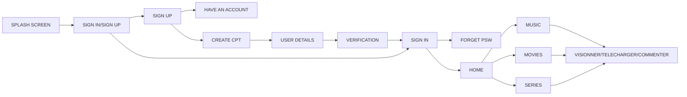

# Bienvenue à PURPLePLAY!

# PRÉSENTATION DU PROJET

## LE PROJET

Notre projet est une application mobile native IOS avec un modèle commercial qui se définit comme une application gratuite avec des publicités.

## PROBLEMATIQUE

Comme nous le savons tous, les médias se développent partout dans le monde sous différents types, c'est pourquoi il est difficile de trouver une application qui englobe tous ces formats particulièrement intéressants dans une seule application.

## OBJECTIF

 - Assemblez tous les types de médias pour que l'utilisateur puisse les voir.
 - Rendre l'application rentable.
 - Allez plus loin que n'importe quelle autre application.

## BESOINS FONCIONNELS

 - Login / Log Out / Sign Up. 
 - Visionner des séries/films.
 - Ecouter de la musique. 
 - Laisser un commentaire. 
 - Ajouter aux favoris. 
 - Mettre un avis. 
 - Rechercher des séries/films.

## BESOINS NON FONCIONNELS

 - Convivialité : les interfaces doivent être simples à l’utilisateur et ayant une bonne ergonomie. 
 - Sécurité : l’accès aux données de la base n’est possible qu’après une vérification de privilèges et droits d’accès. 
 - Performance : l’application doit être accessible à plusieurs utilisateurs à la fois, d’où la nécessité du partage de données.

# ÉTAPE DE CONCEPTION

 - **Une carte d' empathie** est une visualisation collaborative utilisée pour formuler ce que nous savons d' un type d' utilisateur précis.

## LA CHARTE GRAPHIQUE

 - FONT-FAMILY  : Poppins
 - COLEURS : #E778F9 #70338C #E778F9 #B20FFF #E778F9

